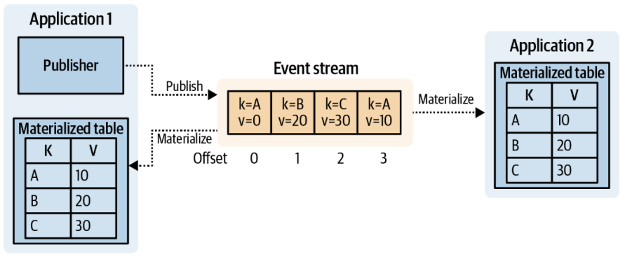

# kafkaConsumer

This repository is one of three github repositories related to the bachelor thesis by me, Felix Wolf. 

While this repo contains a consumer of kafka topics, [library-assistant](https://github.com/felix-wolf/Library-Assistant) is the central monolith application. [Data Liberation - Helper](https://github.com/felix-wolf/DL-Helper) connects the two by liberating the sql-logs of Library-Assistant and converts them into kafka events.

## Content of this repo

kafkaConsumer subscribes to two of the four kafka topics populated by DL-Helper. The events in the streams can be understood as database operations. These database operations are mimiced by the consumer and applied to its own database. This results in a program flow similar to this graphic:

Here, Application1 is Library-Assistant and Application2 is this microservice. The only difference is, that the publishing is done by another microservice (DL-Helper).

### Feature

The main feature of this microservice is sending informative emails to the users of the library system.

Whenever a member is added, updated or removed, the microservice sends emails that are applicable to the context.